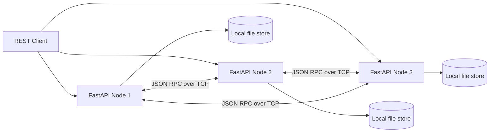
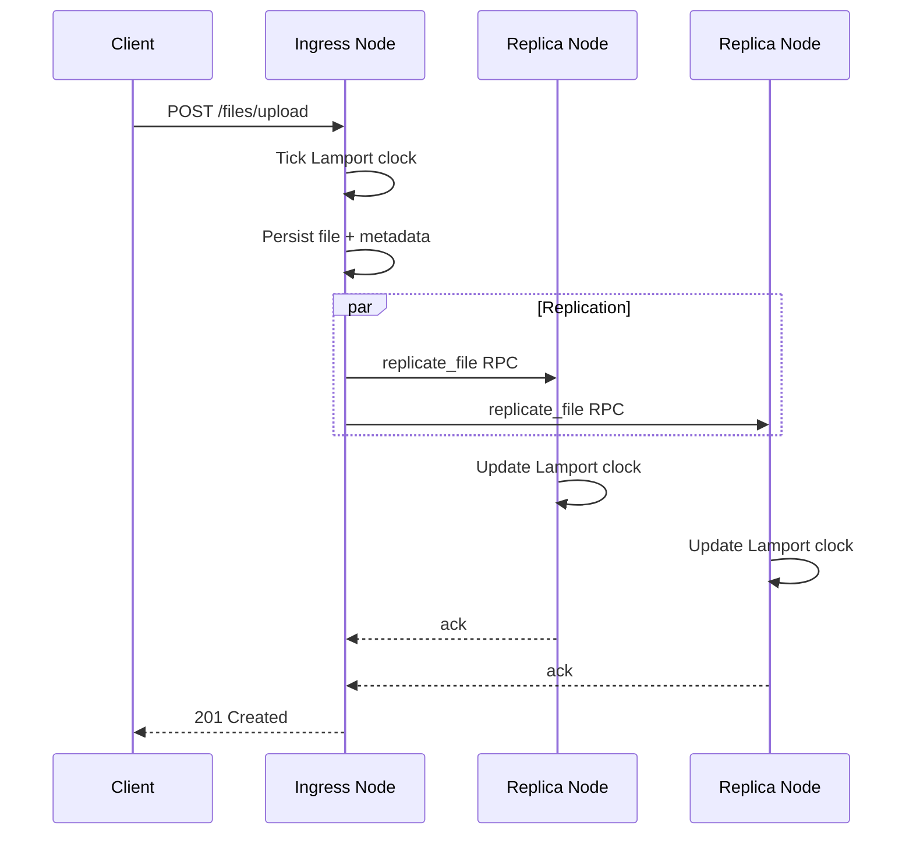
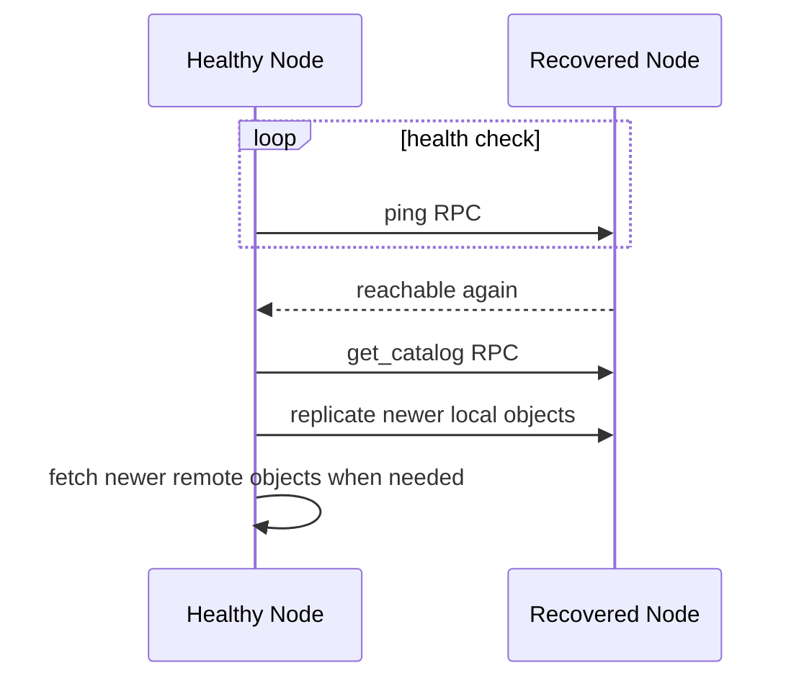

# Distributed File Hosting Architecture

## Component View

## Upload Flow

## Recovery Flow

## CAP Trade-off

This implementation is biased toward partition tolerance and operational availability. During a partition, writes can still succeed when the configured write quorum is met, but a full-cluster consistent view is not guaranteed until synchronization completes. Logical clocks provide deterministic conflict resolution, but they do not preserve full causal history the way vector clocks would.
